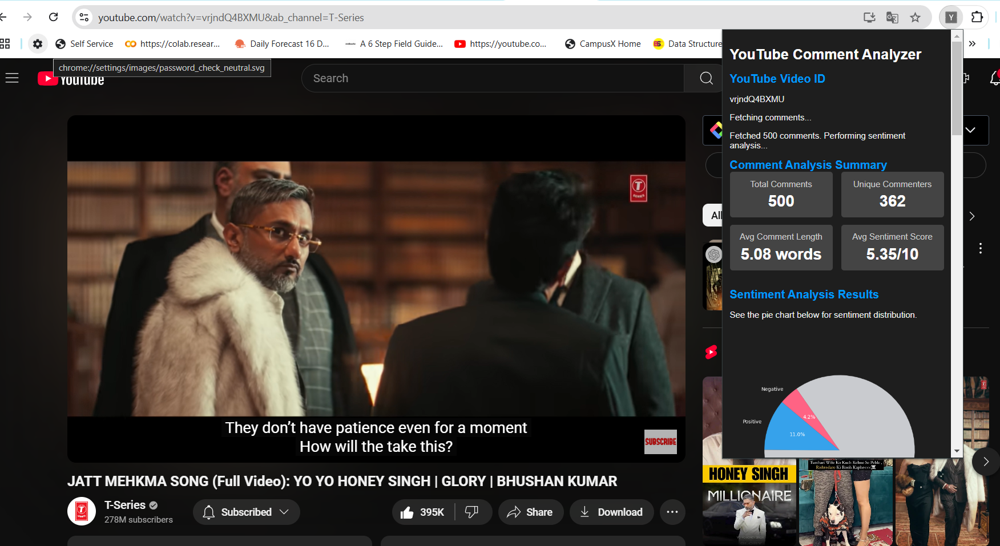

# YouTube Comment Analysis Plugin

## Overview

The **YouTube Comment Analysis Plugin** is designed to help influencers efficiently manage and analyze their YouTube video comments. The plugin provides sentiment analysis, comment summarization, and other advanced comment analysis features, enabling influencers to make data-driven content decisions.

## Business Context

We are **Influence Boost Inc.**, an influencer management company that aims to attract more influencers to our platform by offering tools that address their key challenges.

### Business Problem

- **Objective**: Attract more influencers to expand our service offerings to brands.
- **Challenge**: Limited marketing budget, making traditional advertising channels unfeasible.
- **Pain Point**: Influencers face difficulty in managing and interpreting large volumes of YouTube comments, which impacts their content strategy.

### Solution

The **YouTube Comment Analysis Plugin** solves the influencers' pain point by providing detailed comment analysis, allowing them to derive meaningful insights from their YouTube video comments.

## Key Features

### 1. Sentiment Analysis of Comments
- **Real-Time Sentiment Classification**: Classifies comments as positive, neutral, or negative.
- **Sentiment Distribution Visualization**: Visualizes sentiment distribution using graphs or charts.
- **Detailed Sentiment Insights**: Allows users to explore specific comments within each sentiment category.
- **Trend Tracking**: Tracks changes in sentiment over time to gauge audience reaction to content.

### 2. Summary of Comments
- **Automated Comment Summarization**: Summarizes the most discussed topics within the comments using NLP techniques.
- **Highlight Key Themes**: Identifies and summarizes common feedback, suggestions, and concerns.

### 3. Additional Comment Analysis Features
- **Word Cloud Visualization**: Displays frequently used words and phrases in a word cloud.
- **Average Comment Length**: Shows the average length of comments, helping to measure audience engagement.
- **Spam and Troll Detection**: Filters out spam and harmful comments for a cleaner analysis.
- **Export Data Functionality**: Allows users to export analysis reports in various formats (PDF, CSV).

## Workflow

1. **Data Collection**: Gathering YouTube comments for analysis.
2. **Data Preprocessing**: Cleaning and preparing the data for analysis.
3. **Exploratory Data Analysis (EDA)**: Analyzing comment trends and distributions.
4. **Model Building**: Using machine learning models for sentiment analysis, comment summarization, and spam detection.
5. **API Development**: Building the backend using Flask to serve the model predictions.
6. **Chrome Extension Development**: Creating the user interface for the plugin.
7. **CI/CD Pipeline**: Setting up automated testing and deployment using GitHub Actions and AWS.
8. **Deployment**: Deploying the plugin and model using Docker and AWS services.

## Technologies Used

### 1. Version Control and Collaboration
- **Git**: Version control for tracking code changes.
- **GitHub**: Hosting service for repositories and collaboration.

### 2. Data Management and Versioning
- **DVC (Data Version Control)**: Versioning datasets and machine learning pipelines.
- **AWS S3**: Cloud storage for datasets and model artifacts.

### 3. Machine Learning and Experiment Tracking
- **Python**: Backend development and machine learning.
- **scikit-learn**: Classical machine learning algorithms.
- **spaCy & NLTK**: Natural language processing libraries.
- **MLflow**: Managing the machine learning lifecycle, including experiment tracking and model registry.
- **Optuna**: Hyperparameter tuning.

### 4. Continuous Integration/Continuous Deployment (CI/CD)
- **GitHub Actions**: Automating testing, building, and deployment pipelines.

### 5. Cloud Services and Infrastructure
- **AWS EC2**: Hosting the backend services.
- **AWS CodeDeploy**: Automating deployments.
- **AWS CloudWatch**: Monitoring application logs and performance metrics.

### 6. Frontend Development Tools
- **JavaScript, HTML, CSS**: Building the user interface for the Chrome extension.
- **Chrome Extension APIs**: Interacting with browser features.

### 7. DevOps and MLOps Tools
- **Docker**: Containerization of the application.
- **AWS CodeDeploy & Auto Scaling**: Automating deployment and scaling infrastructure based on load.

## Challenges

- Handling noisy, informal, and multi-language comments.
- Spam detection and handling evolving language trends.
- Managing model latency and user experience in real-time.
- Ensuring data privacy and compliance with regulations.

   